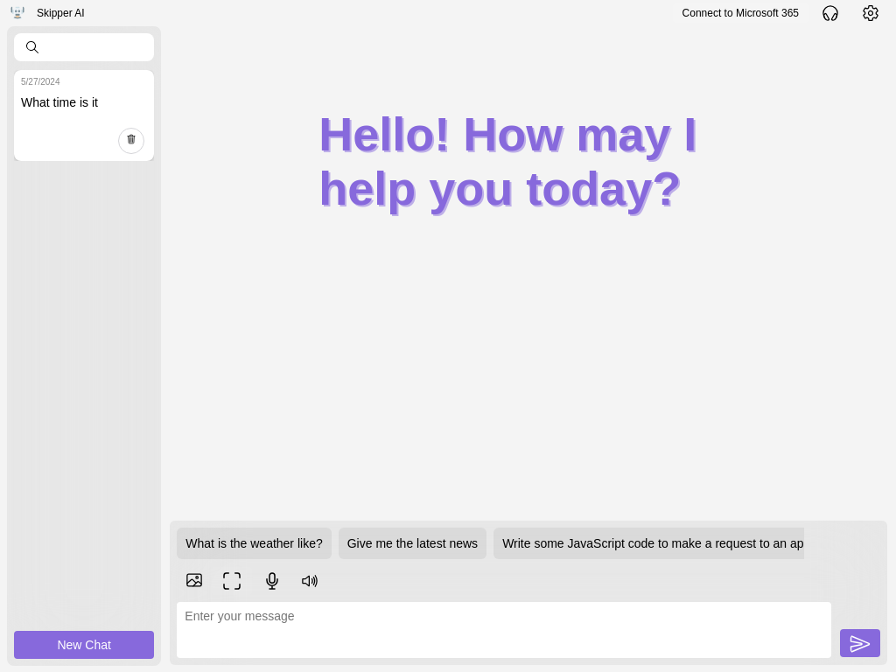

# Skipper

[Launch the App](https://www.skipperai.app/)
[Install from the Microsoft Store](https://apps.microsoft.com/store/detail/9PLHTFMZ98Q5?cid=DevShareMCLPCS)

## Table of Contents
- [Currently Supported Features](#currently-supported-features)
- [Supported Operating Systems](#supported-operating-systems)
- [Screenshots](#screenshots)

## Currently Supported Features

- Dark and light mode support
- Chat with a model running on your device in local mode
- Add more context to chat by adding images, including dragging and dropping images onto the chat
- Share your screen with Skipper to get help with anything you can see on your screen
- Have responses read back to you with lifelike voices
- Chat using your voice with speech-to-text
- Generate images
- Actions
  - Check the weather
  - Check the news
  - and much more

### Connect with Microsoft 365

You can connect to Microsoft 365 by logging in with your Microsoft Account to unlock even more features, such as:

- Search your OneDrive
- Search your Outlook
- Send email
- Manage your ToDo

## Supported Operating Systems

Skipper is completely cross-platform, although Firefox is not supported.

## Screenshots

