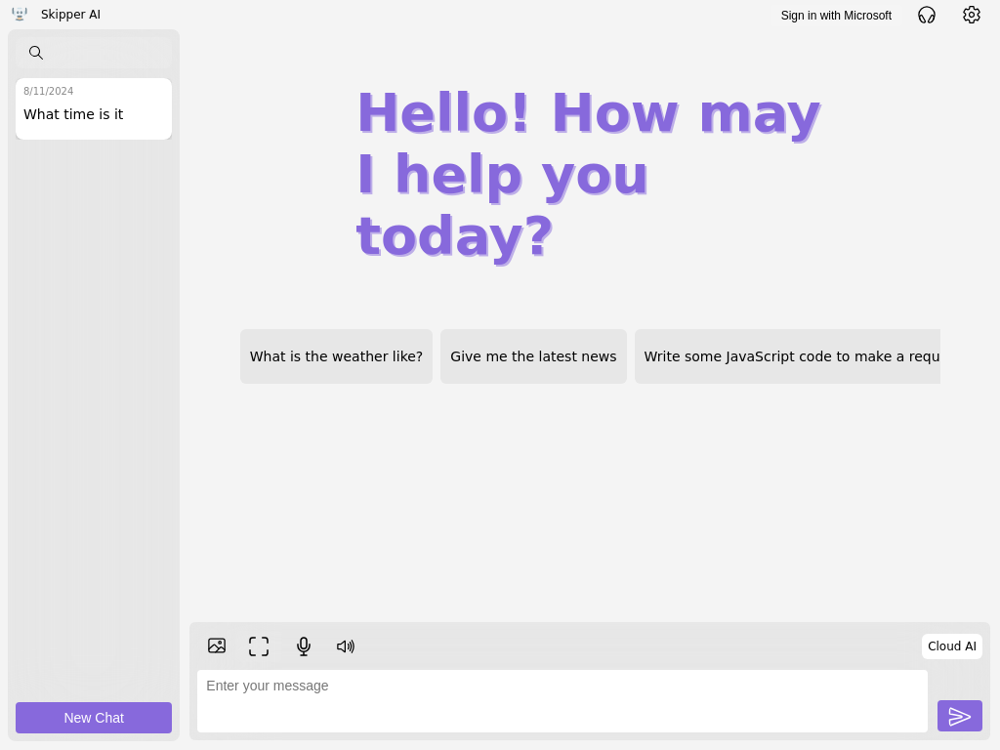

# Skipper

Skipper can work with you how you want. Want to interact with your voice? You can. Need Skipper to see something? Give it an image or share your screen! Simply want text chat? That works too. Skipper is designed to be flexible and work with you.

[Launch the App (on any device)](https://www.skipperai.app/)

## Table of Contents

- [Get Started](#get-started)
- [Currently Supported Features](#currently-supported-features)
- [Supported Devices](#supported-devices)
- [Screenshots](#screenshots)

## Get Started

Getting started with Skipper is easy. The hardest part is grabbing an API key for one of our cloud based models before you start.

Note that to start using Skipper, you must enter your API key for atleast one of our cloud based models (know that if you dont add a Google API key for example, you will not be able to use the Google Gemini model). The app will givey you two inputs to enter your keys upon the first launch of the app. Skipper will use these API keys to chat with these individual models. Note that this will cost money on, for example, your OpenAI account, although the cost is minimal. This also gives you the upside of having full control of your cloud model usage. Please note that your API key does not get stored in any way in the cloud through Skipper. Your keys are only stored locally on your device.

To grab an API key, [start here](https://www.codecademy.com/article/creating-an-openai-api-key?periods=year&plan_id=proGoldAnnualV2&utm_source=pepperjam&utm_medium=affiliate&utm_term=159404&clickId=4684400308&pj_creativeid=8-12462&pj_publisherid=159404)

## Currently Supported Features

- Dark and light mode support
- Chat with a model running on your device in local mode
- Add more context to chat by adding images, including dragging and dropping images onto the chat
- Share your screen with Skipper to get help with anything you can see on your screen
- Have responses read back to you with lifelike voices
- Chat using your voice with low-latency speech-to-text
- Generate images

## Supported Devices

Skipper is completely cross-platform, although Firefox is not supported.

## Screenshots

